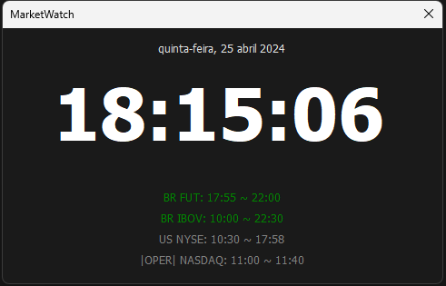

# MarketWatch

__Why__

MarketWatch notify 10 minutes before opening the Exchange and 10 minutes before Exchange is closing.

__Listed Exchanges__

- BR B3 Futures (DOL, WIN)
- BR B3 Spot
- US NYSE

__TODO__

- ~~Action to duplicate the window~~
- ~~Action to open calculator~~
- ~~Action to close the app from a duplicated window~~
- [In progress] Display the next event on calendar with alarm (10 minutes and 2 minutes)
- Screen to register the stock and price
- Alarm 2 minutes before (10 minutes and 2 minutes)
- Change the open song (its to loud and noise)

This is the C# version of [PyMarketWatch](https://github.com/mangar/PyMarketWatch)

